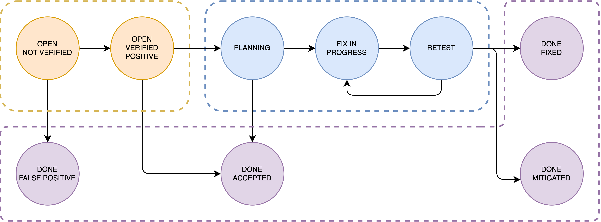
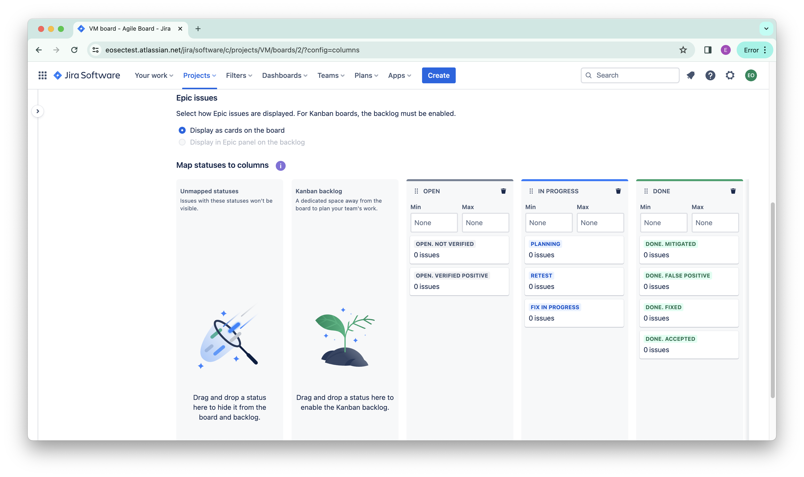
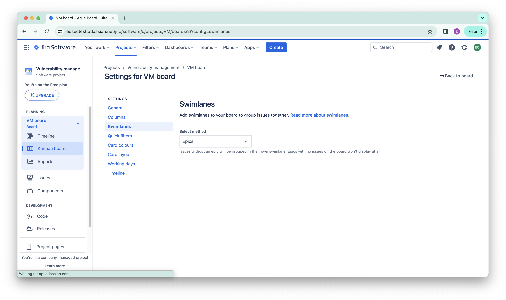
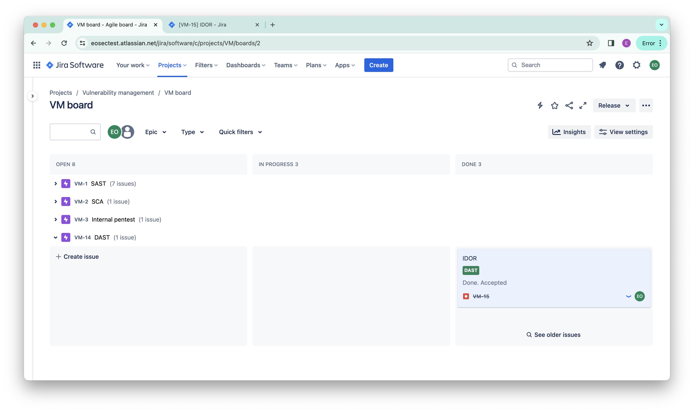
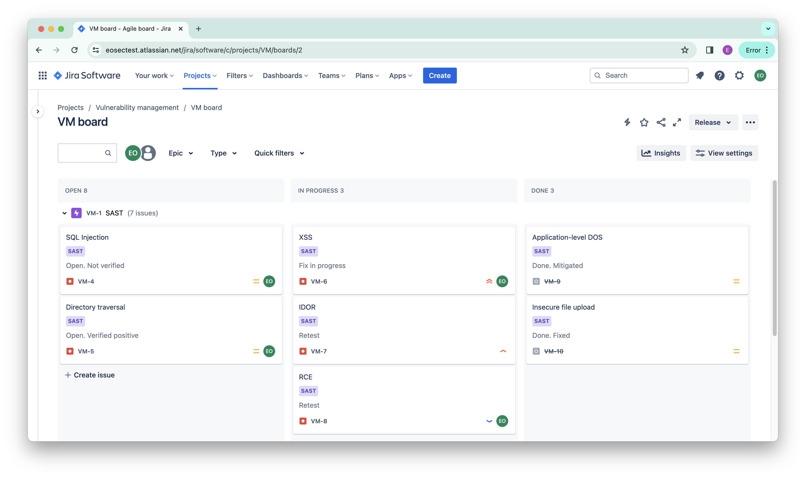
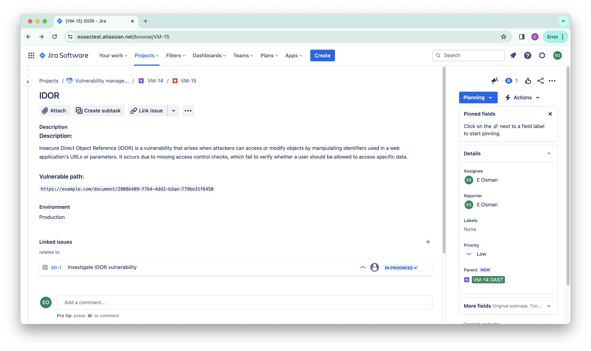
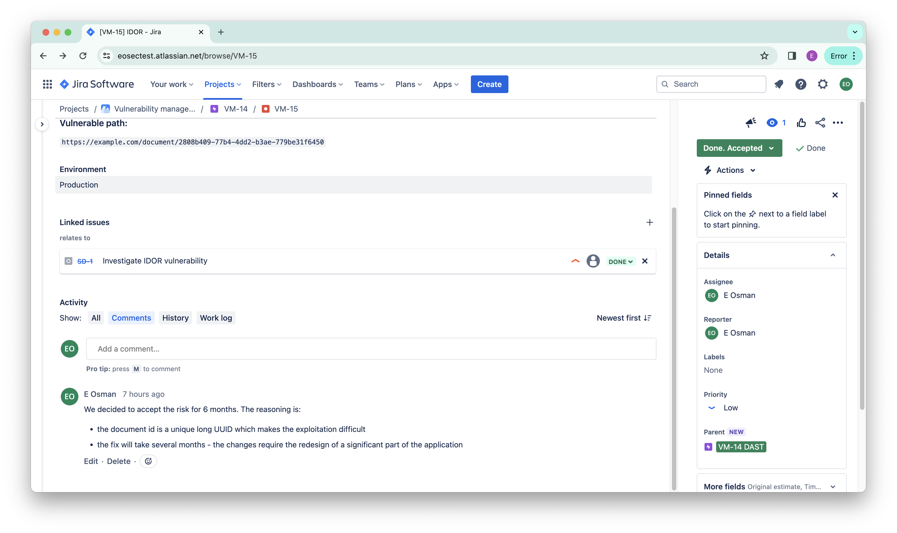

# Vulnerability management for product development in Jira

### Introduction & Problem Statement

An experienced application security engineer can tell that it’s not rare in organizations that penetration testing reports get lost, security scanners are abandoned, and their results are not being used, discovered or reported vulnerabilities are not being addressed. This is a direct result of missing vulnerability management practices within the company.

Vulnerability management is an essential part of any application security program. As an element of the Secure Software Development Lifecycle (S-SDLC), it ensures that security issues are properly handled. Failure to establish vulnerability management for any development environment results in insufficient (or even lacking) vulnerability remediation actions.

Crowdstrike defines Vulnerability management as “… the ongoing, regular process of identifying, assessing, reporting on, managing and remediating cyber vulnerabilities…”. This article will focus on managing the vulnerabilities as well as the processes and tools that support this task.

There are many vulnerability management solutions out there, but this article focuses on how to run it on Jira, a widely used ticketing system among development teams. This approach can be adopted on other ticketing tools with little to no effort and minor changes.

The article reflects a real case that is being implemented by one of the fintech companies.

### General Approach

Any development team or company with established S-SDLC practice has several sources of vulnerability reporting. Usually, they can be divided into 2 categories: automated tools and manual reporting.

Automated tools are:

- Security scanners: SAST/SCA/IAST/DAST/etc.
- Network security scanners.
- Cloud assessment tools, etc.

Manual reporting includes:

- Internal penetration testing reports.
- External penetration testing reports.
- Bug bounty program, etc.

All mentioned sources form a significant pipeline of security issues. These issues represent security risks to a product, and as a result – to the company and its customers. Based on industry best practices and regulations they should be properly recorded and addressed.

One of the ways to solve the chaos with vulnerabilities is to establish a vulnerability management program and back it up with a vulnerability management tool.

### The program

A vulnerability managing program is a document that describes how a company or a development team deals with its security issues. Usually, this paper can be either a policy or a guideline depending on the level of enforcement decided by the company’s management. Despite guidelines which serve as a directive document, policies are mandatory to be followed by its subjects (in this case – the engineering team).

This section of the article aims to highlight the program itself as a documented manual on how to approach vulnerability management.

The main entity that is an object of the program is vulnerability. A vulnerability can be anything that puts the product in jeopardy: a security bug in the course code, a vulnerability in a third-party library, any type of misconfiguration, etc. For the sake of simplicity, each vulnerability is recognized as a risk (even though this is not entirely correct).

A vulnerability must have the following properties:

- Owner – a person who is responsible for the risk at a given moment.
- Severity – level of the risk that poses a vulnerability.
- Status – in what state the vulnerability is in a given moment.

All vulnerabilities must be recorded and have an owner who carries the responsibility for the consequences of the risk.
Based on best practices each vulnerability has a severity assigned to it. The severity shows the level of harm that may bring the vulnerability. Severity can be Critical, High, Medium, Low, and Informational. A status identifies at what stage of the lifecycle vulnerability is in.

_Figure 1. Status change flowchart_

Figure 1 shows the lifecycle of the vulnerability. When a vulnerability is discovered, the corresponding ticket is created with “Open. Not verified” status and is assigned to a person who will carry the risk associated with this vulnerability. After that, it is the job of a security person (application security engineer, penetration tester, etc.) together with a developer to check the vulnerability for false-positiveness.

If the vulnerability is considered to be false-positive, the status is changed to “Done. False positive” and no other actions are needed. An important part of this step is to thoroughly log the decision-making process. This ensures that in case of any issues in future, the team has enough evidence to resolve them.

In case the vulnerability truly exists, the status is changed to “Open. Verified positive”. This is a short-term pause before the vulnerability goes into the planning stage. This stage is needed to distinguish true vulnerabilities from the bulk of new ones while the security function defines the responsible team and the team takes the vulnerability into planning. As an alternative to planning, the team can decide to accept the risk if they do not want to fix the issue. In a such case, the ticket receives the “Done. Accepted” status. Importantly, even though acceptance is a totally valid option, it should be a rare case, not a regular practice.

There are some best practices that companies might want to adopt when it comes to risk acceptance. First, the acceptance should be done only by a defined group of people (usually management) who will carry responsibility for the potential consequences of an open vulnerability. Second, accepted issues should be reviewed on a periodic basis, usually semi-annually. Last, the reasoning for the acceptance should be clearly documented. An example of the acceptance reasoning for the IDOR vulnerability is:

> “We decided to accept the risk for 6 months. The reasoning is:
>
> - the document ID is a unique long UUID which makes the exploitation difficult_
> - the fix will take several months - the changes require the redesign of a significant part of the application”

Whereas vulnerability can be accepted, this route is not the default one. After the “Open. Verified positive” stage, the team takes the vulnerability into the planning and it gets the “Planning” status. During the planning stage team follows their established procedure to take the ticket into work. Usually, teams prefer to create separate tickets in their own spaces and link them to the vulnerability tickets. During the planning, the team can also decide to accept the risk. In this case, they have to follow the steps described earlier.

After planning, the ticket changes its status to “Fix in progress”. As it states, during this stage the vulnerability is fixed. After the fix is done, the status is changed to “Retest”, and it is the job of an application security engineer to verify the validity of the fix. If the fix is not sufficient, the ticket gets the status “Fix in progress” and the team continues fixing and retesting until the vulnerability is no longer exploitable.

After the fix is done and tested, the vulnerability gets either of two statuses: “Done. Fixed” or “Done. Mitigated” depending on the measures which were taken in order to eliminate the vulnerability. “Done. Fixed” is used when the issue is completely fixed. As an example, the source code causing SQL injection was changed to use prepared statements, which completely removed the issue. Alternatively, the “Done. Mitigated” status is used in cases where the direct fix is not possible and the team designed strategies that lower the risk of the vulnerability. Following the same example, if changing the piece of code that causes SQL injection is not possible, the team can use WAF to mitigate the risk.

As it is described above, each vulnerability passes through the pipeline of statuses that closely reflect its lifecycle. It can be noted that the process has a resemblance to the risk management procedures that are used in companies. This is not a coincidence but a direct connection since every vulnerability poses a risk to the product, and as a result, follows a similar procedure.

This chapter described the approach from a “how to” perspective defining steps that enable a successful and healthy lifecycle of a vulnerability. The next chapter will focus on the technical implementation of the process.

### The tool

In order to support the vulnerability management program application security team may use Jira. The basis of the toolset is a Kanban company-managed project that serves as a centralized database of vulnerabilities and a tool to control them.

As a first step after the project creation, it is necessary to set up proper statuses in the board settings as it is shown in Figure 2. The project has 3 columns and 9 statuses associated with them which represent vulnerability lifecycle stages from Figure 1. They are:

- Open:
  - Open. Not verified
  - Open. Verified positive
- In progress
  - Planning
  - Fix in progress
  - Retest
- Done.
  - Done. Fixed
  - Done. Mitigated
  - Done. False positive
  - Done. Accepted

_Figure 2. Jira board setting. Columns and statuses_

After that, the board should be set to display vulnerabilities by epics. This can be done by selecting the corresponding field on the swimlanes setting page (Figure 3). This setting is needed in order to group vulnerabilities by their source.

_Figure 3. Jira board setting. Swimlanes_

When columns and statuses are set, it is time to start creating epics. The general idea is that every source of vulnerabilities gets its own epic: SAST, SCA, IAC, DAST, pentest, bug bounty, cloud-config, etc. (Figure 4). Thus, an epic serves as an entity that groups vulnerabilities based on where they originated from. It is important to create epics based on a specific set of tools/sources because every team or company may have their own unique set. It is not crucial to create all the necessary epics at once – they can be created at any time in future.

_Figure 4. General view of the board. Epics view_

After epics are created, it is time to configure the tools to pipe the vulnerabilities to the board. Each tool should be set up to create tickets with the parent epic that is dedicated specifically for this tool. Also, at this stage, vulnerabilities from pentest reports should be manually reflected here. Usually “Bug” type of ticket serves well to reflect vulnerability. Nevertheless, it is possible to create a custom type that accounts for specific requirements for the necessary fields and layout.

_Figure 5. General view of the board. Vulnerabilities_

Figure 5 displays what the board looks like after the imaginary SAST scanner has created tickets and development teams did some work with vulnerabilities. Different stages of the lifecycle are clearly visible on the ticket cards in the status fields. For the sake of simplicity, the severities of the vulnerabilities are reflected as priorities.

_Figure 6 General view of the vulnerability_

Figures 6 and 7 show the general look of the vulnerability. IDOR vulnerability was discovered by an imaginary DAST scanner and reported to the board. Both figures show the different states of the same vulnerability: planning and acceptance. In the ticket, the scanner added relevant information to the Description section. “Planning” status shows that the ticket was verified positive and was taken into the planning by the development team. The team created a separate ticket in their own software development board in order to investigate and plan the actions on vulnerability. This is visible in the “Linked issues” field of the ticket. After the investigation was done, the vulnerability got a new status “Done. Accepted” with a proper decision-making process that can be seen in the comment section.

_Figure 7. Example of an accepted issue_

### Summary

All described above is a hands-on repeatable approach to handling vulnerabilities. Even though this is not a perfect approach to managing vulnerabilities, it proved its effectiveness in real-world applications. The setup is suitable for companies that develop a single product and have small to no application security teams as well as mature companies with a broad variety of products under development. The approach has a great potential to grow considering the power and flexibility of Jira as a tool.

At the end of the day, cybersecurity is never a state, it’s always a process.
